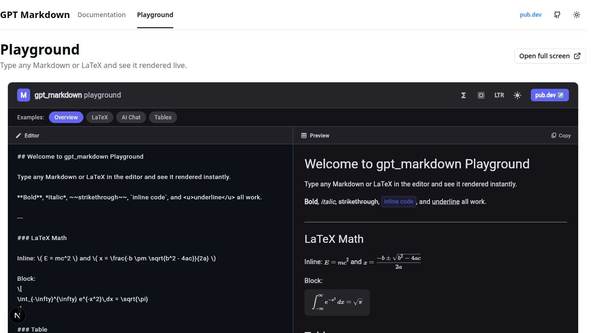

# 📦 GPT Markdown & LaTeX for Flutter

[](https://github.com/Infinitix-LLC/gpt_markdown/actions/workflows/ci.yml) [](https://pub.dev/packages/gpt_markdown) [](https://pub.dev/packages/gpt_markdown) [](https://pub.dev/packages/gpt_markdown) [](https://github.com/Infinitix-LLC/gpt_markdown)

A production-ready Flutter renderer for the complete shape of an AI response:
rich Markdown, LaTeX, code, tables, links, images, citations, task lists, and
your own custom components. Built for responses from ChatGPT, Gemini, Claude,
and any model that speaks Markdown.

Give it the text your model returns and get a native Flutter experience that
stays readable while the answer is still streaming, looks at home in your
app's theme, and remains interactive, selectable, and accessible.

🌐 [gptmarkdown.com](https://gptmarkdown.com) · 📖 [Documentation](https://gptmarkdown.com/docs) · 🎮 [Live Playground](https://gptmarkdown.com/playground)

---

## 🚀 Why Use GPT Markdown?

- **Built for AI outputs**: Render the mix of explanations, code, formulas,
  tables, links, citations, and checklists that modern AI assistants produce.
- **LaTeX out of the box**: Display inline and block mathematics without
  assembling a separate math surface.
- **Beautiful while streaming**: Reveal a growing answer smoothly while keeping
  the settled part of the document intact.
- **Complete Markdown support**: Headings, emphasis, lists, tables, block
  quotes, images, links, code blocks, task lists, radio options, and more.
- **Rich customization**: Style each component, use your app theme, or replace
  individual components with your own Flutter builders.
- **App-specific syntax**: Add `@mentions`, `#channels`, `:emoji:`, source
  tags, and other inline patterns without forking the parser.
- **Selectable and accessible**: Use Flutter's `SelectionArea`, support RTL
  content and text scaling, and respect reduced-motion preferences.
- **Ready for every Flutter surface**: Mobile, desktop, web, and WASM support
  without platform plugins.

---

## Supported Markdown & LaTeX Features

| ✨ Feature | ✅ Supported |
| --- | --- |
| 💻 Fenced and inline code | ✅ |
| 📊 Tables | ✅ |
| 📝 Headings | ✅ |
| 📌 Unordered and ordered lists | ✅ |
| ☑️ Task lists and checkboxes | ✅ |
| 🔘 Radio options | ✅ |
| ➖ Horizontal rules | ✅ |
| 🔢 Inline and block LaTeX | ✅ |
| ↩️ Indentation | ✅ |
| 💬 Block quotes | ✅ |
| 🖼️ Images with optional dimensions | ✅ |
| ✨ Highlighted text | ✅ |
| ✂️ Strikethrough text | ✅ |
| 🔵 Bold text | ✅ |
| 📜 Italic text | ✅ |
| 📎 Underline text | ✅ |
| 🔗 Explicit links and automatic links | ✅ |
| 📱 Selectable content | ✅ |
| 🧩 Custom block and inline components | ✅ |
| 🌊 Streaming reveal animation | ✅ |
| 🎨 Per-component styles and builders | ✅ |
| 🌍 RTL and text scaling | ✅ |

## ✨ Key Features

Render a complete AI answer with one widget. `gpt_markdown` handles the
structure, inline formatting, math, interaction, and customization points so
your app can focus on the conversation itself.

### Markdown that reads like a real answer

```markdown
# Heading 1
## Heading 2

**Bold**, *italic*, ~~strikethrough~~, <u>underline</u>, and `inline code`.

- Unordered list item
1. Ordered list item

> A block quote from the assistant

---
```

### Tables, links, and images

```markdown
[Open the documentation](https://gptmarkdown.com/docs)


| Name  | Score |
|-------|-------|
| Alice | 98    |
| Bob   | 87    |
```

Images can include dimensions in the alt text, and their rendering can be
replaced with `imageBuilder` when your app needs its own image provider,
placeholder, or viewer.

### LaTeX mathematics

Use inline `\(\frac a b\)` or block `\[\frac ab\]` expressions in the same
response as ordinary Markdown:

```markdown
The quadratic formula is:

\[
x = \frac{-b \pm \sqrt{b^2 - 4ac}}{2a}
\]
```

### Interactive task lists and radio options

```markdown
[] Unchecked checkbox
[x] Checked checkbox

() Unselected radio
(x) Selected radio
```

Task lists can be styled as interactive controls and connected to your app with
`onCheckboxChanged`.

### Streaming AI responses

Pass the accumulated response text as it grows. When streaming is enabled,
`gpt_markdown` keeps the settled prefix intact, reveals the unfinished tail,
and fast-forwards to the complete response when generation ends:

```dart
GptMarkdown(
  accumulatedReply,
  animation: GptMarkdownAnimation.fade,
  isStreaming: isGenerating,
)
```

Streaming is opt-in, supports configurable pacing, and respects
`MediaQuery.disableAnimations` for users who prefer reduced motion.

### Automatic links

Bare `https://` URLs, `www.` hosts, email addresses, and angle autolinks become
links automatically—without preprocessing:

```dart
GptMarkdown(
  'Read https://gptmarkdown.com or email ada@example.com',
)
```

Use `autolink: false` to turn this behavior off, or add an app-specific scheme
with `autolinkSchemes`.

### Selectable content

Wrap the widget in Flutter's selection system when users should be able to
highlight and copy an answer:

```dart
SelectionArea(
  child: GptMarkdown(markdownText),
)
```

---

## 🛠️ Getting Started

Add the package:

```bash
flutter pub add gpt_markdown
```

Then import it:

```dart
import 'package:flutter/material.dart';
import 'package:gpt_markdown/gpt_markdown.dart';
```

## 📖 Usage

This example combines the formats an AI assistant commonly returns:

```dart
GptMarkdown(
  r'''
## Hello from gpt_markdown!

Render **bold**, *italic*, ~~strikethrough~~, `inline code`, and <u>underline</u>.

Inline LaTeX: \( E = mc^2 \) and block math:

\[
x = \frac{-b \pm \sqrt{b^2 - 4ac}}{2a}
\]

| Name  | Score |
|-------|-------|
| Alice | 98    |
| Bob   | 87    |

- [x] Task complete
- [ ] Task pending
  ''',
  onLinkTap: (url, title) => debugPrint('Tapped: $url'),
)
```

For the complete walkthrough, see the
[documentation](https://gptmarkdown.com/docs).

## 💡 ChatGPT Response Examples

`gpt_markdown` is designed for the kind of rich answer users expect from an AI
assistant:

```markdown
## ChatGPT Response

Here is a clear answer with Markdown, LaTeX, code, and structured data.

### Markdown Example

- **Bold text** for important ideas
- *Italic text* for emphasis
- [Links](https://www.example.com) users can open
- Ordered and unordered lists for step-by-step answers

### LaTeX Example

The quadratic function is \( f(x) = x^2 + 2x + 1 \).

\[
\begin{bmatrix}
1 & 2 & 3 \\
4 & 5 & 6 \\
7 & 8 & 9
\end{bmatrix}
\]

### Conclusion

Markdown and LaTeX can live naturally inside the same Flutter conversation.
''`
```

### Output from gpt_markdown



If you are using `flutter_markdown` and need LaTeX, streaming, richer
customization, or AI-oriented interactions, `gpt_markdown` gives you one
renderer for the whole answer.

---

## 🎨 Styling and Theming

Customize individual components with `GptMarkdownStyleSheet`, or provide
app-wide defaults with `GptMarkdownThemeData`. Unset values continue to follow
your Flutter `ColorScheme`.

```dart
GptMarkdown(
  reply,
  styleSheet: const GptMarkdownStyleSheet(
    inlineCode: InlineCodeStyle(
      fontFamily: 'JetBrainsMono',
      borderRadius: Radius.circular(6),
    ),
    blockQuote: BlockQuoteStyle(
      barWidth: 4,
      barColor: Colors.indigo,
    ),
    codeBlock: CodeBlockStyle(
      borderRadius: Radius.circular(12),
      showCopyButton: true,
    ),
    latex: LatexStyle(
      scrollBlockHorizontally: true,
    ),
  ),
)
```

Set a consistent style for the entire app:

```dart
MaterialApp(
  theme: ThemeData(
    extensions: [
      GptMarkdownThemeData(
        brightness: Brightness.light,
        styleSheet: const GptMarkdownStyleSheet(
          link: LinkStyle(decoration: TextDecoration.none),
          table: TableStyle(cellPadding: EdgeInsets.all(10)),
        ),
      ),
    ],
  ),
)
```

The style system covers headings, links, lists, code, tables, images, LaTeX,
block quotes, horizontal rules, task lists, radio options, source tags, and
inline code.

---

## 🧩 Builders and Callbacks

When styling is not enough, replace exactly the part of the answer your product
needs to own:

- `codeBuilder` for a custom code viewer
- `latexBuilder` for a different math renderer
- `linkBuilder` and `imageBuilder` for app-specific interactions
- `tableBuilder` for a custom data table
- `headingBuilder`, `blockQuoteBuilder`, and `hrBuilder` for branded structure
- `orderedListBuilder` and `unOrderedListBuilder` for custom list layouts
- `checkboxBuilder` and `radioOptionBuilder` for interactive controls
- `inlineCodeBuilder` for custom inline code spans
- `sourceTagBuilder` for citations and references

Connect the rendered answer to your app with callbacks:

```dart
GptMarkdown(
  reply,
  onLinkTap: (url, title) => openUrl(url),
  onImageTap: (url) => showImage(url),
  onSourceTagTap: (source) => openSource(source),
  onCodeCopy: (code) => copyToClipboard(code),
  onCheckboxChanged: (value) => saveTaskState(value),
)
```

---

## 🏷️ Custom Inline Syntax (`@mention`, `#channel`, `:emoji:`)

Chat and social apps layer their own inline tokens on top of Markdown. Register
them with `inlinePatterns`—no subclassing and no parser fork:

```dart
GptMarkdown(
  text,
  inlinePatterns: [
    // Only known channels become chips, so #2959 can remain an issue number.
    InlinePattern.prefixed(
      prefix: '#',
      knownNames: myChannelNames,
      builder: (context, match, style) => WidgetSpan(
        alignment: PlaceholderAlignment.baseline,
        baseline: TextBaseline.alphabetic,
        child: ChannelChip(
          name: match.group(0)!.substring(1),
        ),
      ),
    ),

    // TextSpan patterns remain selectable and wrap like ordinary text.
    InlinePattern(
      pattern: RegExp(r'(?<![\w-])GH-(\d+)\b'),
      builder: (context, match, style) => TextSpan(
        text: match.group(0),
        style: style.copyWith(fontWeight: FontWeight.w600),
        recognizer: TapGestureRecognizer()
          ..onTap = () => openIssue(match.group(1)!),
      ),
    ),
  ],
)
```

Patterns are matched before built-in components, so your app-specific syntax
can take precedence when it needs to.

### Nesting scopes

Markdown nests—link labels can contain bold text and table cells can contain
links. `MarkdownScope` lets a component declare where it applies:

| Scope | Where |
|---|---|
| `content` | Ordinary document and inline text |
| `linkLabel` | Inside the label of `[label](url)` |
| `tableCell` | Inside a table cell |
| `heading` | Inside a heading |

By default, `InlinePattern` applies everywhere except link labels. This keeps
custom `WidgetSpan`s from becoming nested placeholders that cannot paint on
iOS. Opt into all scopes when your builder returns a `TextSpan`:

```dart
InlinePattern(
  pattern: ...,
  builder: ...,
  scopes: MarkdownComponent.allScopes,
)
```

The same scope controls are available on custom `MarkdownComponent`s.

---

## 🔗 Autolinks

Bare URLs, `www.` hosts, and email addresses become links with no preprocessing:

```dart
GptMarkdown(
  'Ship it: https://pub.dev/packages/gpt_markdown or mail ada@example.com',
)
```

Bare autolinks follow the [GFM autolink extension](https://github.github.com/gfm/#autolinks-extension-), so punctuation and balanced parentheses are handled correctly:

| Input | Link |
|---|---|
| `see https://x.com.` | `https://x.com` — the period stays outside |
| `(https://x.com)` | `https://x.com` — the unbalanced `)` stays outside |
| `https://en.wikipedia.org/wiki/Foo_(bar)` | The whole URL — parentheses balance |
| `www.example.com` | `http://www.example.com` |
| `ada@example.com` | `mailto:ada@example.com` |
| `**https://x.com**` | A bold link — `**` never reaches the URL |

`<https://x.com>`, `<mailto:a@b.com>`, and `<a@b.com>` follow CommonMark §6.5.

### Schemes

`http`, `https`, `mailto`, and `xmpp` are linked bare. Anything else is opt-in
because a bare `myapp://thing` in prose may not be intended as a link:

```dart
GptMarkdown(text, autolinkSchemes: const {'myapp'})
```

Angle autolinks accept any scheme without the allowlist because the author
wrote the brackets deliberately. Turn automatic linking off with
`autolink: false`; explicit `[label](url)` links continue to work.

---

## 💬 Inline Code

Inline `` `code` `` renders as a rounded, tinted monospace chip. Unlike a
widget-based chip, it wraps across lines, stays selectable, sits on the text
baseline, and works inside links, headings, and table cells.

Restyle it with one field; everything you leave out is derived from the ambient
`ColorScheme`:

```dart
GptMarkdown(
  text,
  inlineCodeStyle: const InlineCodeStyle(
    fontFamily: 'JetBrainsMono',
    color: Color(0xFFE01E5A),
  ),
)
```

Set the same style app-wide with `GptMarkdownThemeData.inlineCode`:

```dart
ThemeData(
  extensions: [
    GptMarkdownThemeData(
      brightness: Brightness.light,
      inlineCode: const InlineCodeStyle(
        borderRadius: Radius.circular(6),
      ),
    ),
  ],
)
```

| Field | Default |
|---|---|
| `fontFamily` | Bundled JetBrains Mono, shared with code blocks |
| `fontSizeFactor` | `0.94` of the surrounding text |
| `color` | `ColorScheme.onSurface` |
| `backgroundColor` | `onSurface` at 10% light / 14% dark |
| `borderColor` | `onSurface` at 28% light / 34% dark |
| `borderWidth` | `1.0` — set `0` for no outline |
| `borderRadius` | `Radius.circular(4)` |
| `padding` | `vertical: 1` — no horizontal padding |

### When styling is not enough

`inlineCodeBuilder` returns an `InlineSpan`, keeping inline code on the
baseline, selectable, and able to wrap across lines:

```dart
GptMarkdown(
  text,
  inlineCodeBuilder: (context, code, style, codeStyle) => CodeTextSpan(
    text: code,
    style: style,
    codeStyle: codeStyle.copyWith(
      backgroundColor: code.startsWith('TODO') ? Colors.amber : null,
    ),
  ),
)
```

Return another `TextSpan` to remove the chip. If the design genuinely needs a
widget, use `baselineWidgetSpan`; a `WidgetSpan` cannot wrap across lines and
is skipped by selection, so prefer a `CodeTextSpan` where possible.

---

## 🌍 Built for Real Flutter Interfaces

- **RTL support**: Inline widgets render in the correct visual order in mixed
  direction paragraphs.
- **Text scaling**: Components scale proportionally with the user's text size.
- **Reduced motion**: Streaming animation respects
  `MediaQuery.disableAnimations`.
- **Selection**: Answers can participate in Flutter's `SelectionArea`.
- **Web and WASM**: No platform plugins are required.
- **Safe fallbacks**: Malformed links and unclaimed patterns remain readable
  instead of disappearing silently.

---

## 📚 Documentation and Examples

- [Getting started](docs/getting-started.md) — installation, syntax, taps,
  LaTeX, RTL, and selection
- [Customization](docs/customization.md) — every style class and builder
- [Streaming](docs/streaming.md) — pacing, performance, and reduced motion
- [Inline syntax](docs/inline-syntax.md) — autolinks, patterns, and scopes
- [Custom components](docs/custom-components.md) — block and inline components
- [Testing](docs/testing.md) — testing rendered Markdown and custom components
- [Live Playground](https://gptmarkdown.com/playground) — try the renderer in
  your browser

Run the example catalogue to explore the components interactively:

```bash
cd example
flutter run
```

---

⭐ If you find this package helpful, please give it a like on
[pub.dev](https://pub.dev/packages/gpt_markdown)! Your support means a lot. ⭐

## 🔗 Additional Information

- 🌐 [Website](https://gptmarkdown.com)
- 📖 [Documentation](https://gptmarkdown.com/docs)
- 🎮 [Live Playground](https://gptmarkdown.com/playground)
- 📦 [pub.dev](https://pub.dev/packages/gpt_markdown)
- 🐛 [Issue tracker](https://github.com/Infinitix-LLC/gpt_markdown/issues)
- 💬 [Publisher](https://infinitix.tech)